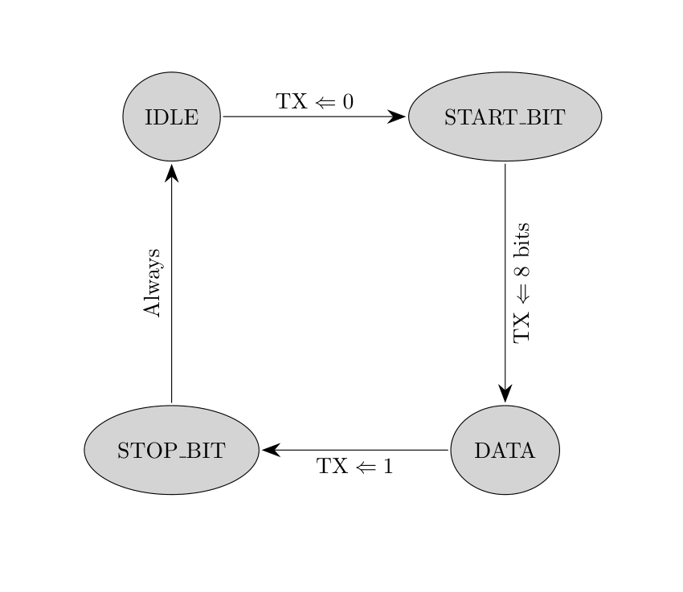

# UART Signal Decoding



Above is the state diagram. There are 4 states:

- When the TX line is being pulled high by it's sender, it remains in idle state. Once that line gets pulled low, it signals to the receiver that a transmission is going to start.
- When the TX line goes low, it switches to the START\_BIT state, which means the start bit has been received, and the next 8 bits will be data bits.
    - After the *first sample* in which the TX line goes low, we start the sample counter. Once the sample counter *exceeds* the samples-per-bit (based on sample rate and baud rate), we consider that sample as the next bit. At this stage, once either the sample counter has exceeded the samples per bit, or the TX line went high, we transition into the DATA\_BITS state.
- In the DATA\_BITS state, we will go through 8 such bits, incrementing the bit index along the way. Once we capture the 8th bit, wait for the next bit to be a logic 1, and transition to the STOP\_BIT state.
- In the STOP\_BIT state, we *ignore* the samples-per-bit, and simply wait for a logic 1 to bring us back to the IDLE state. This allows us to synchronize the transmission with the start bit.

## Example

Below is what we might see on the TX line. To save space, I've condensed the oversampled bits into just two bits; basically samples-per-bit is 2. Time is going from left to right. Only one byte is being transmitted. Also UART sends bytes with the LSB first, so the byte is basically flipped.

```
111111111111100110000000011110000111111111111
```

Stepping through the state diagram gives:

- **IDLE:** as long as the bits are 1, stay in the idle state. On the 14th bit, the line is drawn low; thus we will:
    - Switch to START\_BIT, set current byte as `0x00`, bit counter is 0, sample counter is 0, bit index is 13 (0 indexed).
- **START_BIT:** As long as TX stays 0, and sample counter is less than samples per bit, increment sample counter and bit index. If *either* is false, switch to DATA\_BITS state, set sample counter to 0, and increment bit index.
- **DATA_BITS:** As long as there's no change in the TX line and sample counter is less than samples per bit, increment bit index and sample counter. If sample counter is equal to `int(samples-per-bit / 2)`, shift in the current value of TX *FROM THE MSB SIDE*, then increment bit counter. Shifting in from the MSB side will *reverse the byte* as we require it to be. If the value of TX changes, or the sample counter exceeds the samples per bit, set the sample counter back to 0, and increment the bit index.
    - In our case, below will be the state of sample counter, bit counter, bit index, and current byte throughout the reception of the byte.
    - Once 8 bits have been received, transition to stop bit.
- **STOP_BIT:** Once in stop bit state, wait for TX to be pulled high, and transition back to IDLE.

| Bit Index | Sample Counter | Value of bitstream at index | Bit counter | Current byte | State | Note |
|:---------:|:--------------:|:---------------------------:|:-----------:|:------------:|:-----:|:----:|
|  13  |  0  |  0  |  0  | `0x00 00000000` | START\_BIT |  |
|  14  |  1  |  0  |  0  | `0x00 00000000` | START\_BIT | Sample counter -> change state |
|  15  |  0  |  1  |  0  | `0x00 00000000` | DATA\_BITS |  |
|  16  |  1  |  1  |  1  | `0x80 10000000` | DATA\_BITS | Shift into current byte |
|  17  |  0  |  0  |  1  | `0x80 10000000` | DATA\_BITS |  |
|  18  |  1  |  0  |  2  | `0x40 01000000` | DATA\_BITS | Shift into current byte |
|  19  |  0  |  0  |  2  | `0x40 01000000` | DATA\_BITS |  |
|  20  |  1  |  0  |  3  | `0x20 00100000` | DATA\_BITS | Shift into current byte |
|  21  |  0  |  0  |  3  | `0x20 00100000` | DATA\_BITS |  |
|  22  |  1  |  0  |  4  | `0x10 00010000` | DATA\_BITS | Shift into current byte |
|  23  |  0  |  0  |  4  | `0x10 00010000` | DATA\_BITS |  |
|  24  |  1  |  0  |  5  | `0x08 00001000` | DATA\_BITS | Shift into current byte |
|  25  |  0  |  1  |  5  | `0x08 00001000` | DATA\_BITS |  |
|  26  |  1  |  1  |  6  | `0x84 10000100` | DATA\_BITS | Shift into current byte |
|  27  |  0  |  1  |  6  | `0x84 10000100` | DATA\_BITS |  |
|  28  |  1  |  1  |  7  | `0xC2 11000010` | DATA\_BITS | Shift into current byte |
|  29  |  0  |  0  |  7  | `0xC2 11000010` | DATA\_BITS |  |
|  30  |  1  |  0  |  8  | `0x61 01100001` | DATA\_BITS | Byte reception complete, shift to STOP\_BIT state |
|  31  |  0  |  0  |  8  | `0x61 01100001` | STOP\_BIT  |  |
|  32  |  0  |  0  |  8  | `0x61 01100001` | STOP\_BIT  |  |
|  33  |  0  |  1  |  8  | `0x61 01100001` | STOP\_BIT  | TX pulled high, transition to IDLE, write current byte to channel somehow |
|  34  |  0  |  1  |  0  | `0x00 00000000` | IDLE  |  |

So in this case, given the bitstream above on TX, the output byte for TX should be `0x61`, at the timestamp `time-per-sample * bit index`. This timestamp is a float64, converted to microseconds. Also timestamps are relative to the 516 byte packet they arrive in; so the next processed LogicPacket will start with a timestamp of 0. We might be able to fix this later.
